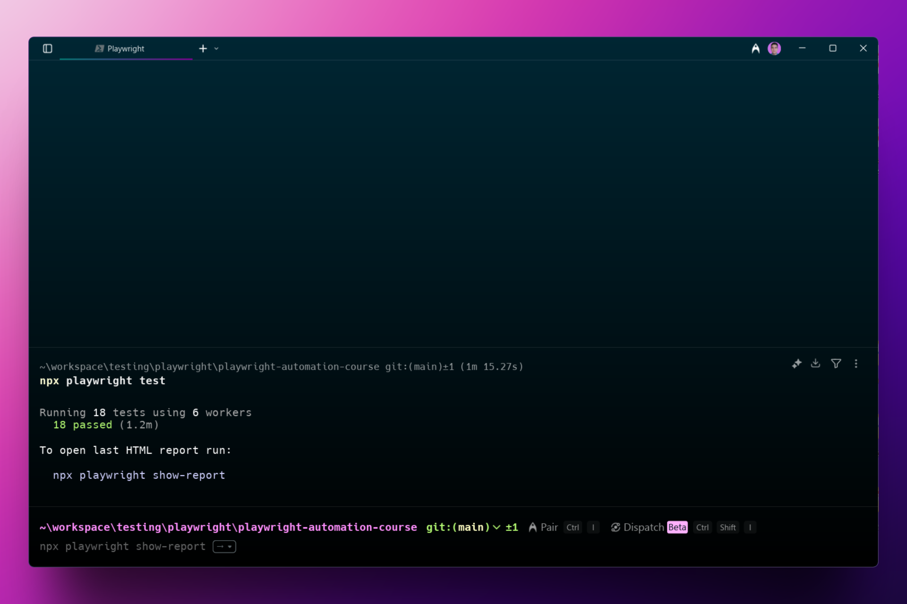
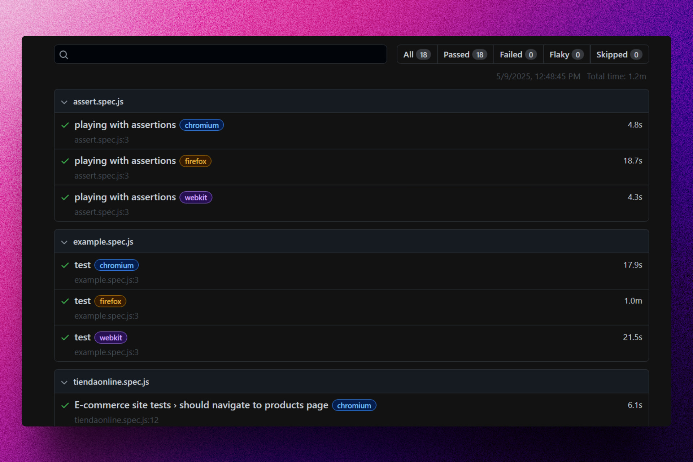
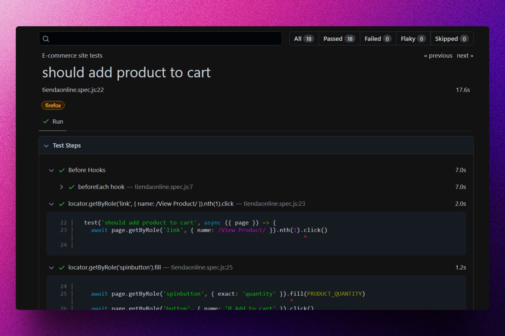

<div align='center'>

# 🎭 Playwright: Automation Course

</div>

### Curso completado para aprender Testing con Playwright.







## 🚀 Descripción

Este repositorio contiene todo el código del curso que he completado para aprender testing en JavaScript con Playwright.

## ⚡ Comenzar

### Prerrequisitos

1. Git.
2. Node.js: cualquier versión a partir de la 18 o superior.

## 🔧 Instalación

### Usando npm

1. **Clona el repositorio:**

   ```bash
   git clone https://github.com/abrahamgalue/playwright-automation-course.git
   cd playwright-automation-course
   ```

2. **Instala las dependencias:**

   ```bash
   npm install
   ```

### Ejecución de tests

Puedes acceder a los diferentes archivos y ejecutar los tests

1. **Ejecuta los tests:**

   ```bash
   npx playwright test
   ```

## 🎭 Tecnologías

- [**Playwright**](https://playwright.dev/) Para realizar pruebas e2e.